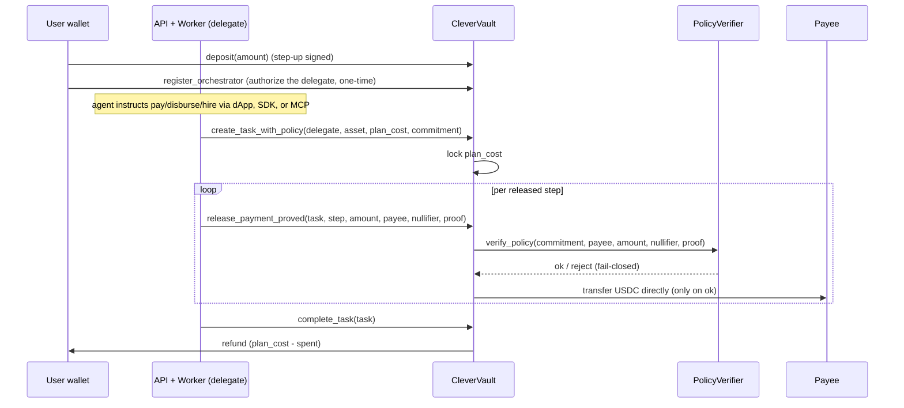

# Architecture

How CleverCon's pieces fit together on Stellar testnet today, and where the
architecture is headed per [ROADMAP.md](../ROADMAP.md).

CleverCon is the non-custodial spending-control layer that lets an AI agent spend
money on Stellar within private, on-chain-enforced limits. You fund a vault, set a
policy (optionally private), authorize a delegate once, and your agent spends
within the policy through any of three doors (dApp, SDK, or MCP). The vault
guarantees on-chain that the agent cannot exceed the budget or pay an unapproved
party, and the platform never holds your funds.

> The earlier hackathon stack (an Express `orchestrator` + JSON `registry` + the
> `packages/agents/*` samples + `contracts/budget-guardian`) has been **removed**
> from the repo to keep it focused; it remains in the git history. `packages/dashboard`
> is kept as the public Vercel demo. This document describes the production stack:
> `apps/web`, `services/*`, `packages/*`, and the deployed CleverVault +
> PolicyVerifier + Registry contracts.

## System overview

```mermaid
flowchart LR
    User["User\n(Stellar wallet)"]
    Web["apps/web\ndApp (React 19)"]
    Agent["AI agent\n(SDK / MCP / chat)"]
    API["services/api\nNestJS"]
    Workers["services/workers\nBullMQ"]
    Indexer["services/indexer\nevent cursor"]
    Vault["CleverVault\nSoroban"]
    Verifier["PolicyVerifier\nSoroban"]
    Provider["Provider\n(x402 or vault-paid)"]

    User -->|connect + sign| Web
    Web -->|REST + WebSocket| API
    Agent -->|x-api-key: pay/disburse/hire| API
    API -->|enqueue settlement| Workers
    Workers -->|create_task / release / complete\n(as the delegate)| Vault
    Vault -->|verify_policy| Verifier
    Vault -->|USDC direct to payee| Provider
    Indexer -->|poll events| Vault
    Indexer -->|mirror balances| API
```

The user's funds sit in CleverVault. A per-user **delegate** key (authorized once
on-chain) is the only thing that can move them, and only within the committed
policy. The delegate holds no funds: the vault pays the payee (or the user's own
agent wallet) directly. Any of the three doors is just a way to tell the API what
to spend; the API validates and records it, and the worker performs the on-chain
lock and proof-gated release as the delegate.

## Components

| Package | Role |
|---|---|
| `apps/web` | The dApp: connect a wallet, fund the vault, build spending limits, instruct an agent in natural language, and watch releases settle live over Socket.IO. React 19 + Vite + Tailwind + TanStack Query. |
| `services/api` | NestJS API. SEP-10 wallet auth, rotating JWTs, RBAC, hashed scoped API keys with daily quotas, step-up auth for money actions, rate limiting, helmet + lockable CORS, `/health` liveness + `/ready` readiness, structured logging, and an OpenTelemetry skeleton. Owns tasks, policies, vault views, activity, webhooks, admin, and the developer platform. |
| `services/workers` | BullMQ workers: task execution (hires), proof generation, and exactly-once **settlement**. Settlement locks the budget on-chain lazily, releases each step proof-gated, and finalizes, all signed by the user's delegate. Per-signer serialization + txBadSeq retry let different users settle in parallel. |
| `services/indexer` | Polls CleverVault events with a resumable cursor and projects them into the read-model (the balance mirror the API serves), so `available` reflects on-chain truth. |
| `services/reference-provider` | A canonical provider implementing the fulfillment contract, built on `createProvider`. Used by the hire flow and the E2E harness. |
| `packages/common` | Shared types, the policy-input encoding, the binding-proof prover, a Redis mutex, and a logger. |
| `packages/db` | Prisma schema + client and AES-256-GCM secret crypto (the delegate secret is stored encrypted, never in the clear). |
| `packages/agent-sdk` | The SDK. `createSpender` (a bounded, non-custodial spending client over the API), `createAgentWallet` (x402 agent-key mode: governed top-up + a paying fetch), and `createProvider` / `createAgent` (be a paid service). |
| `packages/mcp` | The Model Context Protocol server (12 tools) that gives any MCP client a bounded spending account: search, pay, disburse, hire, set limits, read budget and activity. |
| `contracts/agent-vault` | **CleverVault**: non-custodial USDC custody, per-task budget locking, proof-gated per-step release, refunds, replay protection, storage TTL, and admin controls. |
| `contracts/policy-verifier` | **PolicyVerifier**: a fail-closed `verify_policy` the vault cross-calls on every release. |
| `contracts/registry` | On-chain service registration and reputation. |

## Trust model

Being precise about what is and is not trustless matters for anyone evaluating
CleverCon.

### Enforced on-chain

- **Custody.** CleverVault holds all user funds; only the contract can release
  them. The operator and the delegate cannot touch balances outside a policy-passing
  release.
- **Budget.** `create_task_with_policy` locks a plan cost; releases are capped at
  the task's remaining budget; unused budget is refunded on `complete_task`.
- **Policy gate.** Each release calls `PolicyVerifier.verify_policy` fail-closed
  (no verifier set, or a rejected proof, means no funds move and the nullifier is
  not consumed). Replays are blocked per (task, step) and by the nullifier.
- **Settlement.** Every payment is a real Stellar transaction with a verifiable
  hash; no off-chain accounting of moved funds.

### Trusted in v1 (stated honestly)

- **Policy predicate soundness.** The on-chain verifier performs a
  host-accelerated **binding check** over the four public inputs (commitment,
  payee, amount, nullifier), not a full pairing-based UltraHonk verification
  (Soroban has no pairing host function). The Noir circuit that proves the rule was
  satisfied is built and proven in CI, but on-chain today it is the binding anchor,
  so the proving stack is trusted for predicate soundness. See
  [docs/private-policies.md](private-policies.md) section 7.
- **Off-chain rule enforcement.** In v1 the API enforces the caps/allowlist while
  the on-chain budget + commitment + binding proof anchor the release. Full on-chain
  rule verification is blocked on Stellar pairing precompiles.
- **Agent decisions.** The agent chooses who to pay and when within the allowed
  set; it can be wrong about choice or timing, never about the money boundary.

## Fund flow

CleverVault holds USDC on behalf of users. The delegate never holds funds: the
vault transfers directly to the payee on a policy-passing release.



The on-chain lock and release run in the **worker**, not the request path: the API
records the task and returns immediately, and the worker locks the budget lazily on
the first step to settle (inside a per-signer mutex so a signer's transactions never
race the sequence number). This keeps `POST /payments` and `POST /tasks` fast under
load while releases stay serialized per delegate.

### On-chain guarantees

| Guarantee | Enforcement |
|---|---|
| No overspending | releases capped at the task's remaining `plan_cost` |
| Policy obeyed | `verify_policy` must pass (fail-closed) before any transfer |
| No replay / double-pay | idempotent per (task, step); the nullifier is consumed only on a successful release |
| Unused budget refunded | `complete_task` returns `plan_cost - spent` to the user |
| Non-custody | only CleverVault moves funds; the delegate holds none |

### Contract data model (summary)

Per-asset user account (`balance`, `locked`, `total_deposited`, `total_spent`),
a per-user config (the linked delegate + active-task count), per-task info (asset,
`plan_cost`, `spent`, the policy `commitment`, completion), a consumed-nullifier
set, and the configured PolicyVerifier address. See the doc comments in
[`contracts/agent-vault/src/lib.rs`](../contracts/agent-vault/src/lib.rs) for the
exact fields, parameters, and authorization.

## Settlement and reliability

- **Exactly-once.** A release is idempotent on-chain by (task, step); the Payment
  mirror is written under a unique key, so a retry or a race never double-pays.
- **Transient vs deterministic failures.** A transient failure (RPC blip, timeout,
  sequence contention) is retried with backoff; a deterministic one (the contract
  rejected the call) fails the task fast rather than retrying forever.
- **Client idempotency.** `POST /payments` and `POST /tasks` honor an
  `Idempotency-Key` (a `(buyerId, key)` unique), so an agent that retries a timed-out
  call gets the original task back instead of spending twice.
- **Finalization.** Once every released step has settled, the worker calls
  `complete_task` to unlock the remainder and refund the unused budget; PAY/DISBURSE
  tasks are completed here (they have no executor), and registered webhooks are
  notified of the terminal outcome.

## Privacy

A policy is committed on-chain as a hash; the rule itself (caps, allowlist,
window) is never persisted in private mode. Each release carries that commitment,
the payee, the amount, and a one-time nullifier, and the vault verifies a proof
that binds the release to the commitment before moving funds. The ledger shows a
payment was allowed without revealing the rule that allowed it.

The zero-knowledge circuit ([`circuits/spend-policy`](../circuits/spend-policy),
Noir) proves the four composable rule types (per-payment ceiling, rolling cap,
allowlist Merkle membership, deny-list + threshold) without revealing them, and is
green in CI. On-chain verification is the binding check described in the trust
model; full pairing-based verification is pending Stellar precompiles. The
normative spec and threat model are frozen in
[docs/private-policies.md](private-policies.md).

## Payment protocols (agent-key / open economy)

Beyond direct vault-settled releases, an agent can pay **external** x402 or MPP
services with `createAgentWallet`: the vault tops up the agent's own key in bounded
amounts under the policy, and the agent signs the outbound payment. Because
`@x402/stellar` settles testnet payments in the same Circle USDC the vault
dispenses, the two economies compose without a swap, and the platform still never
holds the agent's key. `createPayingFetch` / `withX402` / `withMpp` in the SDK
implement the client and server sides.

## Data persistence

- **PostgreSQL (Prisma)** is the system of record for users, tasks, steps,
  payments, policies (commitment + optional rule summary), API keys, webhooks, the
  balance mirror, and the audit log. The delegate secret is stored **AES-256-GCM
  encrypted** (`packages/db` secret crypto), never in the clear.
- **Redis** backs BullMQ (execution, proofs, settlement), the shared rate limiter,
  the cross-process settlement lock, and the Socket.IO adapter for live updates.

## Where it is headed

Per [ROADMAP.md](../ROADMAP.md): full on-chain ZK verification (pending Stellar
pairing precompiles), a security audit, mainnet with a testnet/mainnet switch,
published SDK + MCP on npm, and real design-partner traction. Longer term,
confidential amounts and counterparties (pending Stellar confidential tokens).
