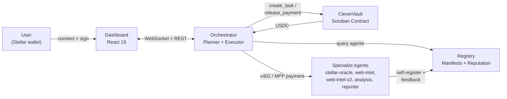
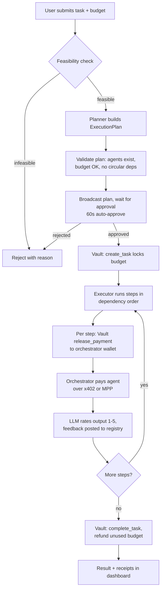
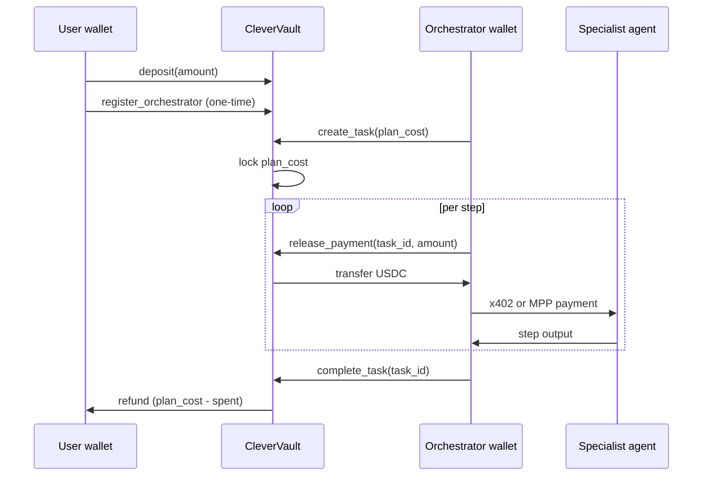

# Architecture

How CleverCon's pieces fit together today, and where the architecture is headed
per [ROADMAP.md](../ROADMAP.md).

CleverCon lets a user delegate a budget to AI agents on Stellar. Funds sit in a
non-custodial Soroban vault, an orchestrator hires agents and pays them per step,
and the vault caps spending and refunds the rest. This document describes what
runs today and marks planned work as such.

## System overview



## Components

| Package | Role |
|---|---|
| `packages/common` | Shared TypeScript types (`AgentManifest`, `AgentRecord`, `ExecutionPlan`, `TaskResult`), Stellar network constants, a logger, and wallet helpers. Imported by every backend package. |
| `packages/registry` | Express API for agent discovery and reputation. Agents self-register on startup, the orchestrator queries it when building a plan, and feedback after each job updates an agent's score. Backed by `data/registry.json`. |
| `packages/orchestrator` | The core service. Plans tasks with an LLM, validates and executes the plan, talks to CleverVault to lock and release funds, pays agents over x402/MPP, and serves the dashboard over REST and WebSocket. |
| `packages/dashboard` | React frontend for connecting a wallet, funding the vault, submitting and approving tasks, and viewing history. |
| `packages/agents/*` | Five specialist agents, each an Express server with a manifest, a `/health` endpoint, and a paid query endpoint. |
| `contracts/agent-vault` | CleverVault, the Soroban contract that holds user USDC and enforces the budget lifecycle on-chain. |
| `contracts/budget-guardian` | An earlier budget-tracking contract, superseded by CleverVault and kept for reference. |

## Trust model

CleverCon's trustlessness applies to some layers and not others. Being clear
about this matters for anyone evaluating it.

### Enforced on-chain

- **Custody.** CleverVault holds all user funds. The contract is the only thing
  that can release payments. The operator cannot touch user balances.
- **Per-step release.** Payments release only after a step is executed, capped
  on-chain at the task's remaining budget. The operator cannot drain funds even
  if the orchestrator misbehaves.
- **Settlement.** Every payment is a real Stellar transaction with a verifiable
  hash. No off-chain accounting.

### Requires trusting the operator

- **Task decomposition.** The orchestrator decides how to split a task into
  steps. A bad orchestrator could produce wasteful plans. Plans are shown to the
  user for approval before execution.
- **Agent selection.** The orchestrator picks which agent fills each step. The
  selection logic is open source and the reputation scoring is transparent.
- **Quality rating.** Reputation updates come from an LLM rating service, which
  the operator could influence. Moving to multiple providers and user-driven
  ratings is on the roadmap.

### Where it is headed

Private spending policies (see [ROADMAP.md](../ROADMAP.md)) let a user commit a
spending rule that the vault enforces on every release without revealing it. At
that point the orchestrator cannot spend outside the rule the user set, which
removes most of the task-decomposition and agent-selection trust above.

## Task lifecycle



The current implementation uses Claude Sonnet for planning and Claude Haiku for
feasibility checks and output rating. The pipeline lives in
`packages/orchestrator/src/server.ts` (`runTask()`) and
`packages/orchestrator/src/executor.ts` (`PlanExecutor`).

## Fund flow

CleverVault holds USDC on behalf of users. The orchestrator only touches user
funds for the moment it takes to relay a per-step payment to an agent.



### On-chain guarantees

| Guarantee | Enforcement |
|---|---|
| One active task per user at a time | `active_tasks_count == 0` required to start a task |
| No overspending | `release_payment` capped at the task's remaining `plan_cost` |
| No mid-task withdrawals | `active_tasks_count == 0` required to `withdraw` |
| Unused budget refunded | `finalize_task` returns `plan_cost - spent` to the user |
| Stuck task recovery | Anyone can call `force_complete_stale_task` after the stale threshold |
| Abort anytime | `cancel_task` (user-authorized) refunds remaining funds immediately |

### Contract data model

- `UserAssetAccount`: per-asset `balance`, `locked`, `total_deposited`,
  `total_spent`, `created_at`.
- `UserConfig`: user-wide settings, including the linked `orchestrator` and
  `active_tasks_count`.
- `TaskInfo`: `user`, `orchestrator`, `asset`, `plan_cost`, `spent`,
  `completed`, `created_at`.
- `OrchestratorOwner(orchestrator) -> user`: reverse lookup that resolves which
  user's funds an orchestrator call affects.

See the doc comments in
[`contracts/agent-vault/src/lib.rs`](../contracts/agent-vault/src/lib.rs) for
per-function parameters, return values, and authorization.

## Payment protocols

### x402, per-call micropayments

Used by `stellar-oracle`, `web-intel`, `web-intel-v2`, and `reporter`.

```
Orchestrator                          Specialist agent
     |-- POST /query ----------------->|
     |<-- 402 Payment Required --------|
     |    { amount: "0.02", currency: "USDC" }
     |                                  |
     |-- POST /query + X-Payment: <tx> >|
     |<-- 200 OK + data ---------------|
```

Implemented in `packages/orchestrator/src/x402-client.ts` (`makeX402Payment`),
built on `@x402/fetch` and `@x402/stellar`. Each attempt (up to 3, with
exponential backoff) uses a fresh signer to avoid stale sequence numbers.

### MPP, streaming session payments

Used by `analysis`. Opens a pre-authorized session and settles the actual amount
used at the end of the call.

```
Orchestrator                          AnalysisBot
     |-- open MPP session (auth amount) ->|
     |<-- stream output ----------------  |
     |-- settle: actual amount used ----->|
     |   (difference returned to vault)   |
```

Implemented in `packages/orchestrator/src/mpp-client.ts` (`makeMPPPayment`),
built on `mppx` / `@stellar/mpp`.

## Agent selection and reputation

Two scores drive the system.

**Reputation score** (`packages/registry/src/reputation.ts`, `calculateScore`):
a 0-100 score on each `AgentRecord`, recomputed after every job.

| Factor | Weight |
|---|---|
| Success rate | 40% |
| Average quality rating (1-5) | 35% |
| Speed | 15% |
| Experience bonus (jobs completed, capped at 50) | 10% |

**Selection score** (`packages/orchestrator/src/selector.ts`, `scoreAgents`):
used when choosing which agent fills a step.

| Factor | Weight |
|---|---|
| Capability match | 35% |
| Reputation score | 30% |
| Price efficiency | 15% |
| Latency | 10% |
| Discovery bonus (agents with < 5 jobs) | 10% |

After each step, `packages/orchestrator/src/rater.ts` asks the LLM to rate the
output 1-5 (defaulting to 3 on error), and the executor posts that feedback to
the registry's `POST /feedback` endpoint.

## Data persistence

The registry and orchestrator persist state as JSON files under `data/`
(gitignored, created at runtime):

| File | Written by | Contents |
|---|---|---|
| `data/registry.json` | `registry/src/store.ts` | Agent manifests and reputation |
| `data/orchestrators.json` | `orchestrator/src/orchestrator-store.ts` | Per-user orchestrator wallet records, including secret keys in plaintext (a known pre-production gap, see [SECURITY.md](../SECURITY.md)) |
| `data/vault-ledger.json` | `orchestrator/src/vault-ledger.ts` | Deposit, withdrawal, and payment ledger for the dashboard |
| `data/activity-log.json` | `orchestrator/src/activity-store.ts` | Recent task lifecycle events |
| `data/task-results.json` | `orchestrator/src/task-results.ts` | Completed task results |

These stores have no file-locking yet, so concurrent writes can race. See the
open issues for planned fixes.

## Where it is headed

Per [ROADMAP.md](../ROADMAP.md), the next steps are private spending policies in
CleverVault, an on-chain agent registry, a Stellar MCP server, a reusable agent
SDK, and a pluggable LLM provider interface. See
[CONTRIBUTING.md](../CONTRIBUTING.md) for priority areas.
